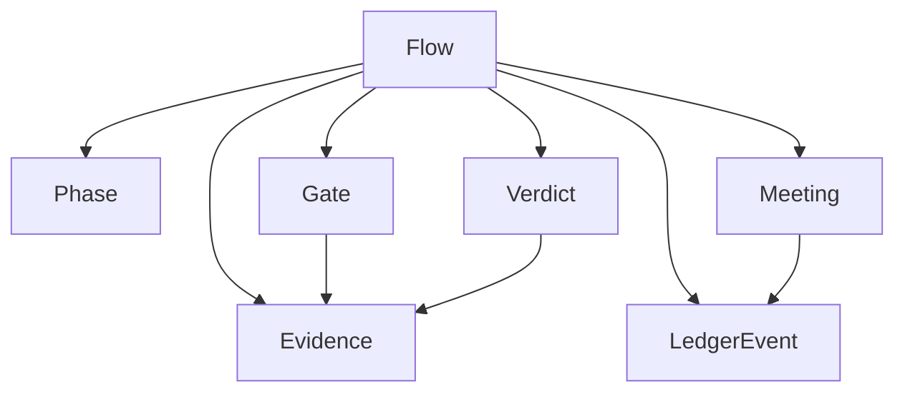

# 01 - Domain Model

## 1. Perguntas de entrevista resolvidas

Este documento aplica a lente de `entrevista-com-docs`: termos vagos sao
pressionados ate virarem linguagem operacional.

| Pergunta | Resposta recomendada |
| --- | --- |
| PPIRTV e metodo, framework ou protocolo? | Metodo operacional guiado por harness; o protocolo de exposicao sera MCP. |
| O que o harness controla? | O fluxo, gates, retornos, reunioes, evidencias e veredito. |
| O harness executa trabalho tecnico? | No MVP, nao. Ele orienta e registra. Execucao automatica so entra depois de contratos. |
| O que e "fase atual"? | Estado canonico do flow, uma das seis fases PPIRTV. |
| O que e "reuniao"? | Artefato estruturado para decisao, nao conversa livre. |
| O que e "retorno"? | Backtrack deliberado com motivo, nao falha silenciosa. |
| O que e "pronto"? | Veredito sustentado por evidencia e risco residual conhecido. |

## 2. Entidades

| Entidade | Responsabilidade |
| --- | --- |
| `Flow` | Representar um ciclo PPIRTV vivo |
| `Phase` | Marcar posicao no processo |
| `Gate` | Bloquear ou liberar transicao |
| `Meeting` | Estruturar discussao e decisao |
| `Evidence` | Sustentar uma afirmacao |
| `Verdict` | Fechar fase, sprint ou flow |
| `LedgerEvent` | Registrar historico auditavel |

## 3. Relacionamentos

## 4. Estados do flow

| Estado | Sentido |
| --- | --- |
| `active` | Em andamento |
| `blocked` | Precisa de decisao externa |
| `complete` | Encerrado com veredito |
| `archived` | Fechado para consulta |

## 5. Invariantes

- Todo flow tem `flow_id`.
- Toda mudanca de fase gera evento.
- Todo retorno tem motivo.
- Todo veredito tem evidencia ou ressalva explicita.
- Toda reuniao tem tipo: divergente, convergente ou transversal.

