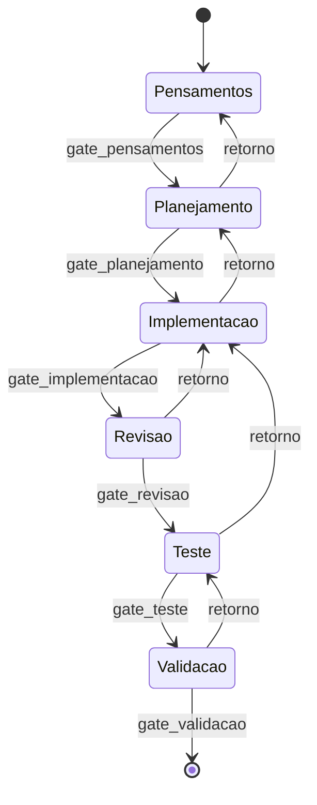

# 03 - Flow Gates

## 1. Maquina de fases



## 2. Gates por fase

### Pensamentos

- Objetivo nomeado.
- Contexto minimo conhecido.
- Risco principal nomeado.
- Incertezas marcadas como lacunas.

### Planejamento

- Escopo definido.
- Fora do escopo definido.
- Tarefas ordenadas.
- Evidencias esperadas definidas.
- Criterio de pronto definido.

### Implementacao

- Mudanca executada.
- Arquivos alterados registrados.
- Se bloqueado, erro e menor proximo ajuste registrados.

### Revisao

- Diff revisado.
- "Barata nunca esta sozinha" aplicado a bugs/residuos.
- Riscos de regressao listados.

### Teste

- Teste real executado ou limitacao explicita.
- Evidencia anexada.
- Falhas reproduzidas ou descartadas.

### Validacao

- Veredito registrado.
- Risco residual registrado.
- Proximo passo definido.
- Casa limpa confirmada.

## 3. Resultado de gate

```json
{
  "gate": "gate_teste",
  "status": "blocked",
  "missing": ["screenshot", "build_log"],
  "next": "execute_test_plan",
  "back_to": "implementacao"
}
```

## 4. Retornos

Todo retorno deve responder:

- O que falhou?
- Qual fase recebe o retorno?
- Qual evidencia mostrou a falha?
- Qual menor proxima acao?

