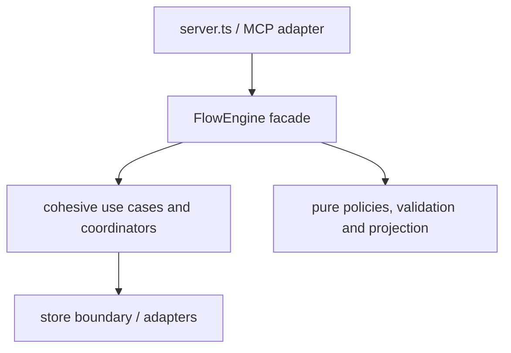

# FlowEngine evolutionary architecture

`LOCALIZER: PPIRTV-FLOW-ENGINE-RESPONSIBILITY-BALANCE`

This is the living public map for editing `src/flow-engine.ts`. It explains
where responsibilities belong, how earlier extractions were performed and what
proof every future editor must provide.

## Exact trigger

> Any diff that changes one line of `src/flow-engine.ts` enters the camping
> gate. Read-only consultation, diagnosis, review, CRG and trace return
> `NOT_APPLICABLE`.

Run:

```powershell
npm run check:flow-engine
node scripts/validate-flow-engine-boundary.mjs --help
```

The fiscal is read-only. It compares Git blobs and the declaration in
`flow-engine-evolution.json`; it never edits or manufactures an abstraction.
An explicit comparison cannot ignore a dirty target worktree.

## Target architecture



Dependency direction is downward. A collaborator must not import
`FlowEngine`. The facade preserves public API, error identity, ledger, store,
idempotency and compatibility while policy and new domain decisions live
outside it.

## Invariants

1. New policy, validation, projection, normalization, helper, branch and domain
   type are born outside `flow-engine.ts`.
2. The facade may retain orchestration glue while its seam is unsafe.
3. A new export requires a real product consumer or an external contract;
   an isolated unit test is not a product consumer.
4. One diff moves one cohesive responsibility. No broad rewrite, speculative
   DI, factory, interface or container.
5. A collaborator never reverse-imports `flow-engine.ts`.
6. Public behavior is compared before/after and the collaborator receives a
   direct causal test.
7. LOC is telemetry. Named responsibilities, symbols, decisions, dependency
   direction and product consumers decide the gate.
8. Every material delivery updates this document, the machine ledger and
   `CHANGELOG.md` in the same change.
9. The declared product consumer must use a runtime import of the facade or
   destination; the facade must use a runtime import of the destination.
   Type-only/unused imports and merely naming existing files are not evidence.

## Gate modes

| Mode | Passes when | Fails when |
| --- | --- | --- |
| `NOT_APPLICABLE` | target is absent from the diff | it is used to hide a real target change |
| `SHRINK` | named pre-existing symbols leave the facade, decisions do not grow, behavior is preserved and any open debt is paid | only comments/formatting/other responsibility were removed |
| `CONTAIN` | behavior lives in a collaborator and the facade gains only import/call/result or error adaptation | a hard decision is added/relocated, a helper, symbol, public surface or more than 20 nonblank glue lines enter |
| `EXCEPTION` | integrity, security, public compatibility or urgent hotfix; causal RED, rollback, expiry, at most 30 nonblank lines and two decisions | it follows another exception or lacks bounded proof |
| `FAIL` | — | declaration, structure, owner, consumer, evidence, changelog or debt payment is missing |

`CONTAIN` opens payable debt. A later `CONTAIN` cannot pass while that debt is
open. A bounded `EXCEPTION` may protect an urgent incident, but it does not pay
the debt and cannot be repeated consecutively.

Hard decisions are `if`, ternary, loops, `case` and `catch`; the fiscal tracks
their containing symbol and expression so deleting an unrelated branch cannot
compensate a new one. `&&`, `||` and `??` are separate guard telemetry:
`CONTAIN` permits at most one only as a named `value ?? fallbackCall()`
call/result adaptation; boolean guards are policy and fail.

## Machine declaration

Each real target diff adds one record to
`docs/architecture/flow-engine-evolution.json`. The fiscal matches
`base_blob` and `head_blob`; unrelated deletion cannot pay the record.
After this gate's introduction, the existing ledger is an immutable prefix:
one target diff appends exactly one record, chains from the preceding target
blob and cannot erase or reorder open debt. Only a validated `SHRINK` may set
`pays_debt_id`.

The one-time bootstrap is not a trust shortcut: the fiscal replays every
historical record from its Git blobs/commit, binds `base_blob` to the real
commit parent and rechecks SPT, destination,
runtime consumer edge, causal test selector, architecture and changelog. The
receipt reports `ledger_bootstrap.status`, record count and sealing.
For a merge commit, the record must name `parent_commit`, and it must be one of
the commit's actual parents.

Minimal `SHRINK` example:

```json
{
  "id": "FE-YYYY-MM-DD-SHORT-NAME",
  "mode": "SHRINK",
  "base_blob": "<git blob before>",
  "head_blob": "<git blob after>",
  "spt_path": ".agents/PLAN-TASKS/<trilho>.md",
  "responsibility": "One responsibility that moved",
  "owner": "$refactoring-fowler-rich",
  "destination_module": "src/<cohesive-module>.ts",
  "consumers": ["src/server.ts"],
  "evidence": ["tests/<causal-test>.test.ts"],
  "evidence_selectors": {
    "tests/<causal-test>.test.ts": "exact test title or causal selector"
  },
  "changelog_marker": "unique delivered-change phrase",
  "architecture_marker": "FE-YYYY-MM-DD-SHORT-NAME",
  "removed_symbols": ["symbolThatLeftTheFacade"],
  "symbol_mappings": { "symbolThatLeftTheFacade": "symbolInDestination" },
  "same_responsibility": true,
  "behavior_preserved_by": ["tests/<before-after>.test.ts"],
  "pays_debt_id": "FE-DEBT-NNN"
}
```

Evidence paths must exist and include a causal test whose declared selector is
present in the file; `npm run check` executes that test suite. `CHANGELOG.md`
must add a new marker under `Unreleased`, and this document must add the new
`architecture_marker`. Debt records the responsibility that opened it, while
`payment_scope: any_verified_shrink` means any cohesive seam may pay the global
monolith balance — but only through every structural and causal `SHRINK` proof.
An `EXCEPTION` accepts only an ISO
date within 30 days or `next diff that touches src/flow-engine.ts` as expiry,
plus an actionable rollback and an existing `test-path::exact test title` RED
bound to the base blob, observed failure and reproduction command.

Useful blob commands:

```powershell
git rev-parse HEAD:src/flow-engine.ts
git hash-object src/flow-engine.ts
```

## Small-agent decision procedure

1. Is `src/flow-engine.ts` absent from the diff? Return `NOT_APPLICABLE`.
2. Is a named existing responsibility leaving it? Prepare `SHRINK`.
3. Is all new behavior already outside and only glue enters? Prepare
   `CONTAIN`, but first check for open debt.
4. Is this an urgent allowed incident? Prepare bounded `EXCEPTION`.
5. Otherwise stop with `FAIL`; do not guess, compress code or delete unrelated
   lines.
6. Run the fiscal and follow `reasons` plus `next_required_action`.

## Evolution already performed

| Record | Mode | Responsibility | Destination | Result |
| --- | --- | --- | --- | --- |
| `FE-2026-08-01-RECALL-CONSUMPTION` | `SHRINK` | recall reference normalization/validation | `src/memory/recall-consumption-contract.ts` | responsibility removed from facade |
| `FE-2026-08-02-SPT-PATH-DIAGNOSTICS` | `CONTAIN` | actionable `spt_path` diagnostics | `src/spt-path-diagnostics.ts` | new behavior contained; `FE-DEBT-001` open |
| `FE-2026-08-11-POST-VERDICT-MINING-GATE` | `EXCEPTION` | prevent terminal completion before post-verdict mining | `FlowEngine` terminal glue | bounded integrity guard with causal MCP RED |

`FE-2026-08-11-POST-VERDICT-MINING-GATE` expires on the next diff that touches
`src/flow-engine.ts`. That visit must remove or relocate the guard through a
safe seam or renew authority through a new causal Trilho; this record does not
pay `FE-DEBT-001`.

## Safe seam sequence

The next target edit must prefer paying `FE-DEBT-001` with one of these small
seams, after fresh mapping and causal baseline:

1. work-progress contract;
2. pipeline-input contract;
3. one family of goal-fiscal policy;
4. blocker guidance or evidence-quality policy;
5. status/checkout projection;
6. meeting coordinator;
7. pipeline runner;
8. goal lifecycle;
9. memory-mining V2 last, because it is more coupled.

The sequence is a candidate map, not permission to extract automatically. The
active SPT selects exactly one seam.

## Ownership and maintenance

- Architecture/extraction owner: `$refactoring-fowler-rich` with
  `$clean-code`.
- Changelog owner: `$projeto-manter-changelog`.
- Fiscal script: `scripts/validate-flow-engine-boundary.mjs`; product/CI
  maintainer surface, input Git refs/worktree, output
  `dex.flow-engine.boundary.receipt.v1` JSON.
- Update trigger: the same diff that touches `src/flow-engine.ts`.
- Removal condition: only after another deterministic project gate produces
  all exclusive evidence above and all documented consumers migrate.
