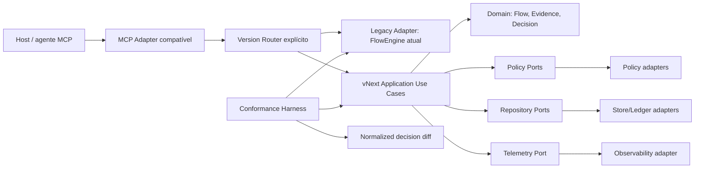

# Decisão arquitetural PPIRTV vNext — 2026-08-03

`LOCALIZADOR: PPIRTV-VNEXT-CLEAN-CORE-ARCHITECTURE-DECISION-RESULT`

## Resumo em português claro

A recomendação é não reescrever tudo agora e também não continuar engrossando
o motor atual. O melhor próximo caminho é construir uma vNext do próprio
`dex-PPIRTV` em fronteira isolada, lado a lado, usando a versão atual como
oráculo de conformidade e rollback.

A versão atual é rigorosa e tem custo operacional alto, mas funciona bem. Essa
confiabilidade é patrimônio do produto. O novo núcleo só recebe tráfego de
produção depois de reproduzir os mesmos resultados relevantes.

Se surgir um produto/MCP com identidade, release, estado ou ciclo de vida
próprios e alto risco de complexidade, ele nasce em outro repositório. Mudança
pequena e coesa não deve criar isolamento artificial.

## Veredito

Estratégia recomendada: **núcleo vNext compatível, isolado e side-by-side no
próprio produto**.

Não recomendado agora:

- reescrita greenfield completa, pois perderia um oráculo funcional maduro e
  ampliaria simultaneamente domínio, persistência, protocolo e migração;
- somente extrair peças do monólito sem arquitetura-alvo, pois reduzir linhas
  localmente não garante redução de contexto ou protocolo;
- fundir autoridades internas de revisão e veredito: a primeira produz
  contraditório; a segunda decide a partir das provas.

A decisão muda se o novo runtime adquirir identidade, deploy, armazenamento,
versionamento ou lifecycle independentes, ou se a prova side-by-side mostrar
que o isolamento neste repo é inviável.

## Baseline confirmado

| Sinal | Evidência atual | Leitura permitida |
| --- | --- | --- |
| Produto | 32 tools MCP; SPT v3; perfis `full` e `compact` | sistema funcional e contratualizado |
| Full | 6 fases | maior separação visual de responsabilidades |
| Compact | 4 fases | já une Pensamento+Planejamento e Revisão+Teste |
| FlowEngine | 8.621 linhas | dívida estrutural; não prova latência dominante |
| CRG | 1.801 nós, 29.735 arestas, 69 arquivos, HEAD `339e3ca` | grafo atual e utilizável |
| Pontes | `goalStatus`, `FlowEngine`, `renderChecklist`, `mineMemory` | seams de alto impacto, não autorização de extração |
| Acoplamento | `src-flow`→`src-goal` 35; memória 28; PPIRTV 22 | separação exige contrato, não movimento mecânico |
| Benchmark | `evidence_add` chegou a 85% das mutações em 40 critérios | custo de protocolo cresce linearmente |
| CPU observada | máximo direto de 6% do FlowEngine no benchmark anterior | monólito não foi confirmado como causa dominante |
| Multimodelo | fila misturada em `duration_ms`; semântica/modelo efetivo não provados | arqueologia/contexto permanecem hipóteses |

Fontes: `src/phase-profile.ts`, `src/domain.ts`, `src/server.ts`,
`src/flow-engine.ts`, snapshot do sistema, matriz multimodelo e CRG sincronizado.

## Responsabilidades e evidências exclusivas

| Responsabilidade | Owner | Entrada | Saída | Evidência exclusiva | Consumidor | Falha evitada | Custo atual | Consolidação visual |
| --- | --- | --- | --- | --- | --- | --- | --- | --- |
| Pensamento | reunião/questionamento | objetivo, contexto, riscos, incertezas | intenção e premissas explícitas | decisão de qual problema merece compromisso | Planejamento | resolver problema errado | leitura e divergência antes do plano | sim, com Planejamento |
| Planejamento | sprinter | intenção validada | escopo, tarefas, critérios e provas esperadas | vínculo requisito→critério→task→evidência | Implementação | executar sem corte verificável | materialização/validação do SPT | sim, com Pensamento |
| Implementação | executor | plano autorizado | estado material, paths e fingerprint | identidade concreta da revisão implementada | Review/Teste | afirmar entrega inexistente | mutação, persistência e fingerprint | não |
| Revisão | revisor independente | artefato/fingerprint, escopo e riscos | review receipt com findings | contraditório independente sobre o mesmo fingerprint | Veredito/executor | autor aprovar o próprio ponto cego | inspeção, barata scan e classificação | mesmo painel, autoridade separada |
| Teste | testador | comportamento e expectativas | test receipt com execução/bordas | observação executada, distinta da leitura do diff | Veredito | confundir leitura com funcionamento | build, suíte, smoke e fixtures | sim, em Assurance |
| Veredito/Validação | validador | review/test receipts, critérios e riscos | verdict receipt, risco residual e próximo passo | decisão de aceitação e destino | usuário/runtime | fechar sem prova ou destino | reconciliação fiscal e continuidade | painel final, sem produzir review |

Conclusão: reduzir fases visíveis é seguro quando as evidências continuam
distintas. O compact já comprova Pensamento+Planejamento como `concepcao`. A
fusão mais segura para uma UX futura é `Review + Teste = Assurance`; Veredito
permanece decisão separada, ainda que apareça no mesmo painel final.

## Dívida de recuperação observada

A percepção de erros semelhantes repetidos entre projetos aponta uma dívida
mais profunda que quantidade de fases: o sistema pode detectar o problema sem
impossibilitar a mesma tentativa inútil.

O runtime atual não parte do zero: `flow-engine.ts` já calcula assinaturas de
blockers, mantém `loop_monitor` e escala repetições em rotas fiscais; os testes
`T25c`, `T25d` e `T25e` cobrem escalada e reset após progresso. O gap a provar é
de abrangência e consumo: nem toda classe de erro MCP está necessariamente sob
essa política, e um cliente pode não obedecer ao receipt. Portanto, vNext deve
extrair e generalizar o mecanismo existente, não fingir que ele não existe.

Contrato requerido para cada falha vNext:

| Campo | Função |
| --- | --- |
| `code` + assinatura estável | reconhecer repetição real |
| `owner` + `field` | dizer quem altera qual dado |
| estado esperado | declarar o que precisa mudar antes do retry |
| `next_required_action` única | remover tentativa e erro |
| `required_proof` | bloquear retry sem nova evidência |
| `attempt_count` + assinatura | diferenciar repetição de progresso |
| escalada/meeting | mudar estratégia quando o estado não muda |

Regra: a mesma assinatura não pode recomendar a mesma ação depois de uma
tentativa sem mudança de estado. Deve falhar antes da mutação e escalar para o
owner correto. Detectar não significa corrigir; detectar, rotear, provar a
correção e só então liberar o retry é o ciclo completo.

## Matriz das três estratégias

| Critério | Simplificar atual | Núcleo vNext side-by-side | Greenfield em novo repo |
| --- | --- | --- | --- |
| Compatibilidade imediata | alta | alta via adapter/conformance | baixa no início |
| Isolamento da lógica atual | médio | alto | máximo |
| Reuso das salvaguardas | alto, acoplado | alto, por contrato | precisa ser reconstruído |
| Redução de acoplamento | gradual | explícita por ports/use cases | alta, com risco de reinvenção |
| Reversibilidade | média | alta; volta ao legacy | alta para repo, difícil para dados/cutover |
| Custo de migração | baixo por slice | médio e controlável | alto |
| Risco de regressão | cresce a cada visita | contido por equivalência | alto até maturidade |
| Contexto entregue ao agente | tende a permanecer amplo | pode ser recortado por use case/adapter | pode ser mínimo, mas precisa reaprender o domínio |
| Prova de correção | suíte e contratos atuais | conformance diferencial + suíte atual | nova suíte + migração; sem oráculo interno inicial |
| Custo operacional durante transição | baixo agora, cumulativo | médio e temporário, controlado por ledger/sunset | alto: dois produtos, releases e stores |
| Adequação agora | manutenção pequena | **melhor equilíbrio** | somente sob gate independente |

## Arquitetura-alvo conceitual

Regras:

- domínio não importa MCP, filesystem, Zod, ledger ou `FlowEngine`;
- casos de uso dependem de ports, não adapters;
- persistência e protocolo ficam nas bordas;
- adapter legado fica disponível até o cutover completo;
- router é explícito e versionado, nunca fallback silencioso;
- nada novo entra em `flow-engine.ts` por padrão;
- erros são transições de estado tipadas, não apenas mensagens.
- loop/retry é política transversal consumida por todos os adapters, não lógica
  repetida apenas em algumas rotas fiscais.

### Separação operacional de Review e Veredito

- `review_receipt` cita o fingerprint imutável, targets, principal observado
  quando a superfície o expõe, findings e limitações;
- `test_receipt` cita o mesmo fingerprint e execução observada;
- `verdict_receipt` apenas consome receipts correntes; não pode criar Review ou
  Teste na mesma ação;
- quando identidade/independência do principal não for comprovável, o receipt
  declara `independence=unknown`, nunca “revisor independente” como fato;
- em mudança material, `independence=unknown` causa HOLD por padrão; exceção
  exige owner nominal, justificativa, escopo, risco aceito e marco de expiração;
- qualquer mutação posterior muda o fingerprint e invalida Review/Teste;
- a UI pode agrupar Assurance+Decision, mas as autoridades e receipts continuam
  separados.

### Ledger strangler obrigatório por fatia

| Campo | Regra |
| --- | --- |
| responsabilidade/fatia | uma única capacidade coesa |
| fonte canônica | exatamente legacy ou vNext por estágio |
| autoridade de escrita | exatamente uma; shadow nunca escreve |
| modo shadow | mesmos inputs, saída vNext apenas comparada |
| divergência | classificada como invariant, compatibilidade aceita ou defeito legado |
| cutover | só após corpus contratual e falhas/restart verdes |
| rollback | reativar autoridade legacy sem migrar história |
| sunset | owner, condição e prazo/marco obrigatório |
| remoção | somente após rollback drill e zero consumidor legacy |

Nenhuma fatia seguinte começa enquanto a anterior tiver duas autoridades de
escrita, divergência sem classificação ou sunset sem owner/quando.

## Gate proporcional de isolamento

Owner decisor: owner do produto + arquitetura; divergência material exige SPT
de decisão antes de criar estrutura.

| Gatilho verificável | Destino obrigatório |
| --- | --- |
| release/versionamento e roadmap continuam os mesmos | candidato a vNext isolada no repo atual |
| deploy/processo operacional precisa ser independente | novo repositório |
| store, migração e retenção possuem ownership/lifecycle próprios | novo repositório |
| namespace/API promete produto diferente, não versão compatível | novo repositório |
| rollback exige remover ou reescrever o produto atual | bloquear; redesenhar isolamento ou novo repo |
| correção pequena, coesa e compatível | arquitetura atual, com Trilho e testes |

Precedência: qualquer gatilho de soberania independente de deploy, store,
release ou operação vence a preferência pelo mesmo repo. Complexidade é sinal
de risco e aciona revisão, mas sozinha não escolhe linguagem ou repositório.
Exceção exige ADR/SPT com owner, validade, rollback e data/marco de expiração.

## Primeiro experimento recomendado

Criar, em outro Trilho técnico, um slice determinístico `EvaluatePhaseGate` em
fronteira vNext isolada. Ele recebe snapshot normalizado e devolve `passed`,
`missing`, `blockers` e `next_required_action`; não escreve store, ledger ou
memória. O snapshot inclui `action_signature`, `attempt_count`, fingerprint
antes/depois e `required_proof`; um port de histórico fornece esse resumo após
restart sem acoplar o core ao store.

O harness compara:

1. rota atual (`goal_gate_preflight`/`goal_status`) como oráculo;
2. novo use case isolado;
3. normalizador semântico que ignora texto livre.

Entrada:

- contrato de input/output congelado;
- fixtures full/compact, happy path e falhas repetidas;
- fixtures de restart com assinatura/contagem persistidas;
- zero import do vNext em `flow-engine.ts`;
- zero tráfego de produção no core novo.

Sucesso:

- equivalência semântica nos cenários acordados;
- repetição da mesma assinatura sem mudança de estado é bloqueada/escalada;
- restart preserva assinatura e contagem; mudança material de fingerprint ou
  prova requerida reinicia a decisão de forma explícita;
- dependências apontam para dentro;
- custo medido separado de host/fila;
- rollback é desativar o router experimental.

Kill criteria:

- exigir mutação do monólito para cada cenário;
- duplicar políticas sem fonte de conformidade;
- não representar blockers/next action sem acessar store direto;
- introduzir fallback silencioso ou reescrever história;
- repetir a mesma recomendação após tentativa sem mudança de estado;
- slice ficar maior ou mais acoplado que a responsabilidade substituída.

Metas que impedem convivência indefinida:

- 100% dos cenários contratuais da fatia classificados, sem divergência
  inexplicada;
- zero rota com duas autoridades de escrita;
- 100% das falhas cobertas com owner, próxima ação e prova requerida;
- restart e rollback drill verdes antes do cutover;
- cada entrada do ledger possui marco de sunset; marco perdido bloqueia nova
  fatia e força decisão de continuar, reverter ou separar em novo repo.

Owner: arquitetura do `dex-PPIRTV` + futuro owner do vNext.

Quando: somente após aceite desta decisão e SPT técnico próprio. Se o slice
revelar identidade/lifecycle independentes ou isolamento inviável, voltar ao
Planejamento e avaliar novo repositório.

## Fatos, inferências e não provado

Fatos: perfis/gates estão em `phase-profile.ts`; adapter MCP está em
`server.ts`; motor concentra vários casos de uso; CRG aponta hubs, pontes e
acoplamentos; compact já reduz seis para quatro fases.

Inferências: `PhaseProfile` é seam promissor; um core side-by-side oferece hoje
o melhor equilíbrio entre isolamento e preservação do produto funcional.

Não provado: que vNext será mais rápida; que menos fases reduzem tokens ou
wall-clock; que o monólito causa a arqueologia; linguagem, SemVer ou repo de um
produto futuro; equivalência do core antes do experimento.

## Próximo passo recomendado

Criar SPT técnico separado para `EvaluatePhaseGate` side-by-side. Ele não altera
a rota atual, não cria produto independente e não faz cutover. Só depois de
equivalência e métricas decide-se ampliar o core ou avaliar novo repositório.
