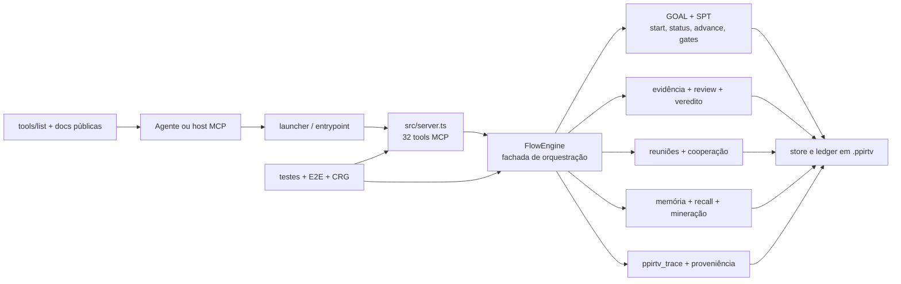
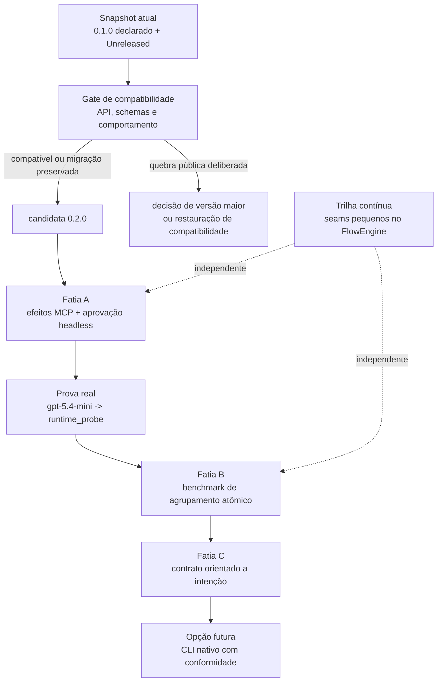

# Snapshot do sistema e mapa de evolução — 2026-08-03

`LOCALIZER: PPIRTV-SYSTEM-SNAPSHOT-2026-08-03`

| Campo | Valor confirmado |
| --- | --- |
| Versão documental | `1.0.0` |
| Data de corte | `2026-08-03`, America/Sao_Paulo |
| Revisão Git | `339e3caddc2a8c3732b7ff6ee3bbaa9f0985b34f` |
| Branch e upstream | `main == origin/main` no corte |
| Versão declarada do produto | `0.1.0` em `package.json` e `package-lock.json` |
| Release comprovada por tag | nenhuma tag Git encontrada |
| Estado de mudanças | `CHANGELOG.md` em `Unreleased` |
| Contrato de execução novo | SPT v3 |
| Superfície MCP | 32 tools registradas |
| SDK MCP local | `@modelcontextprotocol/sdk@1.29.0` |
| CRG | 1.797 nós, 29.409 arestas, 69 arquivos, `head_matches_build=true` |

Este documento é um snapshot imutável do estado observado nessa revisão. Uma
mudança futura relevante deve gerar um novo snapshot datado; não se deve
reescrever este arquivo para aparentar que o passado já possuía o estado novo.

## Resumo em português claro

O dex-PPIRTV já possui um motor funcional e bem testado para SPT, GOAL,
evidência, review, reunião, memória e proveniência. O problema de velocidade
observado não foi explicado principalmente pelo processamento interno do
monólito: no benchmark atual, a repetição de chamadas `evidence_add` cresceu
uma a uma com os critérios, enquanto a participação direta máxima de CPU do
`flow-engine.js` ficou em 6%.

O teste real com `gpt-5.4-mini` encontrou `runtime_probe`, mas o host cancelou a
chamada antes de entrar no motor. Hoje nenhuma das 32 tools publica annotations
MCP de efeito. No SDK instalado, a ausência desses campos deixa defaults
conservadores: `readOnlyHint=false`, `destructiveHint=true`,
`idempotentHint=false` e `openWorldHint=true`. Isso é um gap real e uma causa
plausível de aprovação/cancelamento, mas ainda não foi provado como causa
única.

Por isso, o próximo corte não é criar “Flash”, agrupar provas nem reescrever o
motor em Delphi. Primeiro devemos publicar efeitos verdadeiros para todas as
tools e provar `runtime_probe` pela rota de produção. Depois medimos o
agrupamento atômico de provas. Um CLI nativo continua sendo opção de adapter
futuro, condicionado a um contrato de conformidade; Delphi não é uma decisão
anterior à prova.

## O sistema atual

### Fronteiras confirmadas

| Fronteira | Responsabilidade atual | Evidência viva | Estado |
| --- | --- | --- | --- |
| Entrada | resolver workspace e subir o servidor MCP | `src/launcher.ts`, `src/index.ts`, `runtime_probe` | funcional |
| Contrato MCP | registrar schemas, descrições e handlers | `src/server.ts`, 32 `registerTool` | sem annotations de efeito |
| Orquestração | coordenar GOAL, gates, evidências, reuniões, memória e checkout | `src/flow-engine.ts` | funcional, grande e acoplado |
| Domínio | tipos, contratos e políticas auxiliares | `src/domain.ts` e módulos focados | em evolução |
| Persistência | estado de flow e ledger append-only | store local e `.ppirtv` | funcional |
| Ajuda pública | ensinar fluxo e invariantes | `tools/list`, `README.md`, `docs/` | schema dinâmico continua autoritativo |
| Prova | testes, E2E, benchmark e grafo | `tests/`, `.agents/REPORTS`, CRG | baseline reproduzível |

Os caminhos sob `.agents/` e o banco CRG são evidência local do mantenedor e
não fazem parte do pacote público. Este snapshot incorpora os resultados,
unidades, limites e revisão necessários para leitura externa, mas não afirma
que as amostras brutas são distribuídas. Repetir o benchmark fora deste
workspace exige publicar ou recriar um harness próprio em Trilho separado.

## Foto estrutural do acampamento

O arquivo `src/flow-engine.ts` possui 366.925 bytes e 8.621 linhas de conteúdo
na leitura atual. O benchmark armazenado contou 8.622 ao incluir a terminação
final; essa diferença de método não muda o diagnóstico. O SHA-256 observado é
`676693efaaa1ee7040935349ac817244923a1caea010cf6f222d830ef2460af0`.

O CRG sincronizado no mesmo HEAD encontrou 33 comunidades. Os acoplamentos
estruturais mais visíveis passam por `src-flow` com `src-goal`, memória e
PPIRTV. `goalStatus`, `FlowEngine` e `tracePpirtvArtifact` aparecem como pontes.
Esses sinais indicam blast radius e bons lugares para investigar; não
autorizam extração automática.

O desenho vivo e a regra de cada visita ao monólito permanecem em
[FlowEngine evolutionary architecture](FLOW_ENGINE_EVOLUTION.md). O princípio
é o acampamento dos escoteiros: quem edita procura uma única abstração pequena,
coesa, reversível e provada. Consulta somente leitura é `NOT_APPLICABLE`.

## Medição que orienta a evolução

| Observação | Resultado atual | Leitura correta |
| --- | ---: | --- |
| Amostras completas | 27/27 | instrumento reproduziu o fluxo sintético |
| Falsos verdes instrumentais | 0 | baseline útil para comparação |
| Crescimento de `criterion_proof` | 1:1 | custo de round-trip cresce linearmente |
| `evidence_add` em 40 critérios | 40/49 calls, 85% das mutações | principal candidato de otimização de protocolo |
| Inclinação observada | 13,35 ms por critério adicional | exploratória, no ambiente medido |
| Overhead do controle de review | 1 evidência, 2 calls, 49,81 ms | `review_required` é visível, mas não domina a curva |
| Maior CPU direta de FlowEngine | 6% | não sustenta culpar o monólito pela latência dominante |
| `goalStatus` | McCabe 65, 302 LOC | dívida arquitetural real, separada da causa de performance |
| Consumidor `gpt-5.4-mini` | 240 s, 40 leituras, 0 calls MCP concluídas | bloqueio antes do motor, na integração/descoberta/aprovação |

Limites: p95 é exploratório com três ou cinco amostras; o profiler adiciona
overhead; bytes medem o resultado decodificado, não o wire bruto; o teste do
modelo não prova que annotations ausentes são a única causa.

## Os quatro relógios de versão

| Relógio | Exemplo atual | O que ele significa | O que ele não significa |
| --- | --- | --- | --- |
| Produto | `0.1.0` | versão declarada do pacote | release comprovada sem tag/receipt |
| Contrato | SPT v3, receipt v1/v2 | shape e semântica de uma interface | versão do produto inteiro |
| Documento | este snapshot `1.0.0` | evolução deste texto | compatibilidade do runtime |
| Perfil/geração | `compact`, `full`, Dex Memoria V2, Dex Method vNext | modo ou geração nomeada | número SemVer do pacote |

A política normativa está em
[Product versioning contract](../contracts/PRODUCT_VERSIONING_CONTRACT.md).
Hoje o estado honesto é: produto declarado `0.1.0`, trabalho acumulado em
`Unreleased` e nenhuma release nova autorizada.

## Mapa do caminho para a próxima versão

### Fatias e gates

| Ordem | Fatia | Owner | Critério de saída | Quando |
| ---: | --- | --- | --- | --- |
| 0 | snapshot + política de versão | documentação + release owner | fontes públicas indexadas; número não confundido com release | neste bloco |
| 1 | annotations de efeito e aprovação headless | `mcp-server-design` | 32/32 tools classificadas; `runtime_probe` executado pela rota real sem filtro/proxy/wrapper | próximo Trilho |
| 2 | agrupamento atômico de `criterion_proof` | API design + evidence owner | comparação antes/depois; receipt por proof; erro parcial explícito; cobertura inalterada | somente após a fatia 1 verde |
| 3 | contrato orientado a intenção | arquitetura + consumidores | menos calls/contexto/retries com equivalência fiscal | após dados da fatia 2 |
| 4 | adapter CLI nativo | reunião arquitetural | mesma suíte de conformidade do MCP; sem tradução literal do monólito | somente se o contrato de intenção justificar |
| contínua | redução do monólito | `$refactoring-fowler-rich` | uma extração pequena com baseline, consumidor e rollback por visita autorizada | quando `src/flow-engine.ts` entrar no diff |

## Gate de compatibilidade da release

A comparação por nome entre a declaração `0.1.0` e este snapshot encontrou 27
tools antigas, 32 atuais, cinco adições e nenhuma remoção. As adições são
`goal_gate_preflight`, `goal_progress_record`, `mm_memory_candidate_resolve`,
`ppirtv_trace` e `runtime_probe`.

Isso ainda não fecha compatibilidade: a mudança de nova execução SPT v2 para
SPT v3 pode ser uma quebra comportamental. Antes de escolher uma release, o
owner deve comparar schemas, defaults, erros e rotas suportadas. Se houver
quebra pública deliberada, ela não pode ser escondida em patch/minor; o owner
deve restaurar uma migração compatível ou tomar uma decisão explícita de versão
maior.

## Checklist visual do mapa

- [x] `D-01` — runtime e workspace confirmados por `runtime_probe`.
- [x] `D-02` — Git, versão declarada e ausência de tags confirmados.
- [x] `D-03` — CRG confirmado com `head_matches_build=true`.
- [x] `D-04` — benchmark e limites reabertos da fonte viva.
- [x] `D-05` — defaults de annotations confirmados no SDK local instalado.
- [x] `D-06` — caminho sequenciado com owner, gate e quando.
- [ ] `X-01` — publicar annotations 32/32 — owner: `mcp-server-design`; quando:
  próximo Trilho autorizado.
- [ ] `X-02` — provar `runtime_probe` com `gpt-5.4-mini` na rota real — owner:
  executor/orquestrador + integração do host; quando: depois de `X-01`.
- [ ] `X-03` — decidir versão da release pela auditoria de compatibilidade —
  owner: release owner; quando: antes de bump, tag ou publicação.
- [ ] `X-04` — medir agrupamento atômico — owner: evidence/API; quando: depois
  de `X-02` verde.

## Fora deste snapshot

- Nenhum `mode fast` ou `mode flash` foi criado.
- Nenhum agrupamento de evidências foi implementado.
- Nenhuma configuração `enabled_tools`, proxy, filtro ou wrapper exclusivo foi
  usada como solução.
- Nenhum código de `src/flow-engine.ts` foi alterado.
- Nenhuma decisão de reescrever o produto em Delphi foi tomada.
- Nenhum bump, tag, release, commit ou push é concedido por este documento.

## Fontes vivas usadas

- `package.json`, `package-lock.json`, `CHANGELOG.md` e histórico Git.
- `src/server.ts`, `src/flow-engine.ts` e tipos do SDK MCP instalado.
- `.agents/REPORTS/2026-08-02-fast-lane-compact-v3-benchmark.md`.
- `.agents/PLAN-TASKS/2026-08-02-benchmark-fast-lane-compact-v3.md`.
- API do Code Review Graph no HEAD citado.
- `runtime_probe` do processo MCP conectado a este workspace.

As quatro últimas fontes são receipts locais de mantenedor; o documento não as
apresenta como arquivos disponíveis no pacote publicado.
